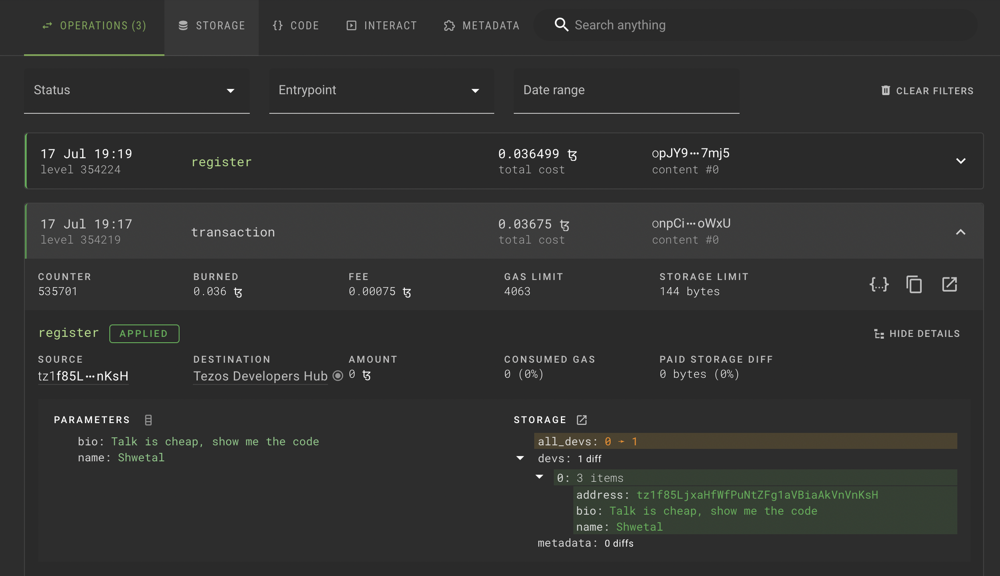
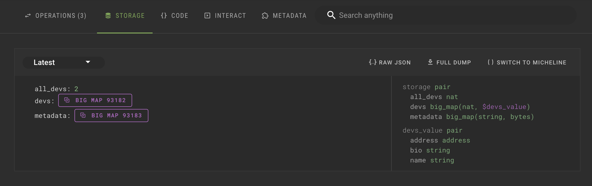
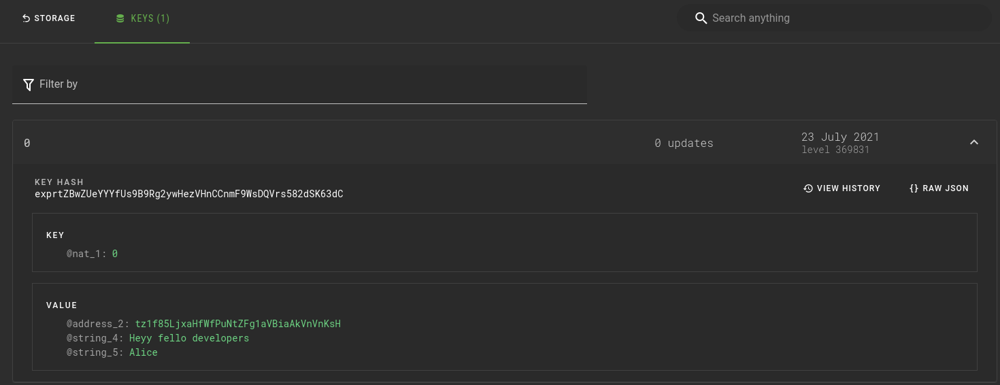
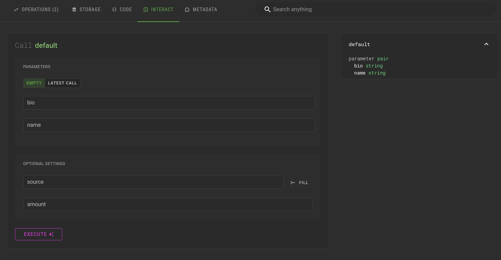

# BCD (Better Call Dev)

Better call dev is a contract explorer for Tezos. It plays a crucial role in smart contract development, testing, and interaction in Tezos.

Go to [better-call.dev](https://better-call.dev/). You can search for contracts by their address as well as the name specified in their metadata.

Once you have found the contract, you can:

- View operations on the contract
- View contract storage
- View contract's Michelson code
- Interact with the contract
    
    You can also use the simulate feature to preview the output without applying it.
    
- View its metadata

# Illustrative example

For demonstrating the features of BCD, an example contract `KT1Qf7edc37iMtPZPqvVxPSgpRsdhmjJkh71` is used as example:

### Contract operations

Go to:

[https://better-call.dev/florencenet/KT1Qf7edc37iMtPZPqvVxPSgpRsdhmjJkh71/operations](https://better-call.dev/florencenet/KT1Qf7edc37iMtPZPqvVxPSgpRsdhmjJkh71/operations)

Here you can view all the transactions of this contract. It gives information such as time of operation, sender, fees, parameters, contract storage change as well as information about all internal operations.

### Contract Storage

Go to the STORAGE tab:

[https://better-call.dev/florencenet/KT1Qf7edc37iMtPZPqvVxPSgpRsdhmjJkh71/storage](https://better-call.dev/florencenet/KT1Qf7edc37iMtPZPqvVxPSgpRsdhmjJkh71/storage)

Here you can see the current state of the contract storage.

You can also click on a bigmap to see its content.

### Call contract entrypoints

Go to the INTERACT tab:

[https://better-call.dev/florencenet/KT1Qf7edc37iMtPZPqvVxPSgpRsdhmjJkh71/interact?entrypoint=default](https://better-call.dev/florencenet/KT1Qf7edc37iMtPZPqvVxPSgpRsdhmjJkh71/interact?entrypoint=default)

Here you can call the contract entrypoints:

- Select the entrypoint from the sidebar on the right (only one entrypoint in this example).
- Fill in the parameter fields (bio and name here).
- You can also fill the optional settings
    - **source** is the wallet address which the operation will be simulated. You can enter anyone's address to see how it can change the contract storage. It is useful only while simulating the operation.
    - **amount** is the amount of tezos in mutez to transfer to the contract with the operation.
- On the EXECUTE button, select:
    - **simulate** to test the operation to see its expected result, without actually executing it.
    - **temple/beacon** to actually execute the operation using your wallet.

