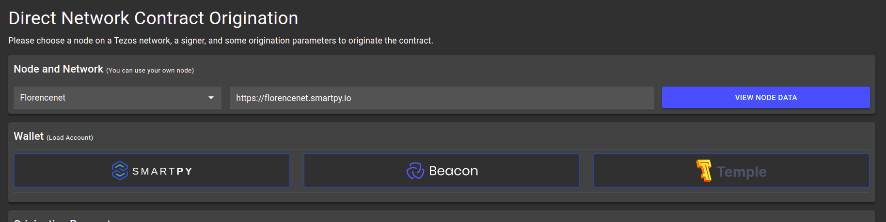

# Deploying and interacting with smart contracts

In this section, you will set up your wallet, deploy the contract on a public tezos testnet and then interact with it using [smartpy explorer](https://smartpy.io/explore.html) and [better-call.dev](https://better-call.dev/).

<aside>
💡 As tezos is upgradable, new testnets appear after every 3 months and older ones are made absolute. So, always use the testnets of the latest protocols. Learn more about Tezos protocols [here](https://tezos.com/).

</aside>

## Set up wallet

For handling transactions and interacting with a smart contract, you'll need a wallet. Here you'll learn to set up **Temple wallet**. Temple wallet is a browser extension based wallet, similar to Metamask in Ethereum.

- Download Temple wallet for your browser [here](https://templewallet.com/download).
- Once installed, follow the steps to create a new wallet.

[https://www.youtube.com/watch?v=S8_tL8PfCts](https://www.youtube.com/watch?v=S8_tL8PfCts)

- New accounts will have 0 balance. Ping [@tezos_faucet_bot](https://t.me/tezos_faucet_bot) on Telegram to get free tez on the testnets.

> For more details on wallets refer [here](https://www.notion.so/Wallets-4e9996a6d10a42bb885c387edd289923)
> 

## Originating the smart contract

For deploying smart contract, follow the steps below:

1. After running the code, in the output generated, click on **Deploy Michelson Contract.**

1. You will be directed to the origination page. Here, select the network to *Hangzhounet* and connect with temple wallet.

> **Note** ⇒ Select the latest network.
> 

1. If it is your first time doing a transaction with Temple wallet, i.e., first time deploying a smart contract using an account, you should **Reveal Account** first.  
    
    If you try deploying your contract without Revealing your Account, you will get an error that says: *(branch: proto.011-PtHangz2.contract.unrevealed_key)*
    
    
    

1. Click on *Estimate cost from RPC* to estimate the storage and gas limit. It defines the maximum amount of storage and gas fees that can be used by the operation. The **storage fee** is the cost of storage on blockchain and **gas fee** is the cost of computation to execute the operation on-chain.

1. Finally, click on **Deploy Contract**.

1. If you have followed the steps correctly, then you'll see this. Click on **Open Explorer** to explore the contract on SmartPy.

<aside>
💡 In Tezos, contract addresses start with "KT..." and user wallet addresses, also known as implicit accounts have addresses starting with "tz...".

</aside>

## Interacting with contract

Once the contract has been deployed, you can go to contract explorers such as **SmartPy Explorer** or **Better Call Dev** to interact with it.

### 1. SmartPy Explorer

Go to [Smartpy explorer](https://www.notion.so/Glossary-e9a82a9d0faa4d279ecee6faa6b3e7c5) [here](https://smartpy.io/explorer.html).

Enter the contract address (starting with KT...) generated in the last section. It will search for the contract and then show its details.

You can perform operations on the contract using the **Operation Builder** section on the page as shown below.

1. Select the entry point from the dropdown, fill in the details, and hit **Build Transaction Parameters**.

1. Before sending the transaction, connect the wallet. Then click **Send the Transaction** button. Here, the amount field shows the amount of tez to send with the operation to the contract. The message is the Michelson encoded parameters. You can leave the fields unchanged.

1. After the transaction is completed, refresh the page to view current storage.

### 2. Better Call Dev

Go to Better Call Dev [here](https://better-call.dev/). You can search for contracts by their address as well as the name specified in their metadata.

Once you have found the contract, you can:

- View operations on the contract
- View contract storage
- View contract's michelson code
- Interact with the contract
    
    You can also use the simulate feature to preview the output without applying it.
    
- View its metadata

Go to the **INTERACT** tab. Fill the bio and name fields and execute it using temple wallet.

Go to the **STORAGE** tab to view `devs` map. Here you can see the details of the registered devs.

