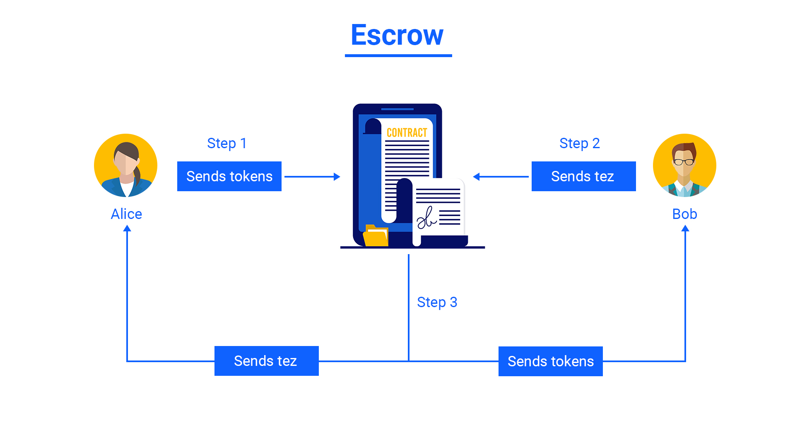

# Escrow

In this module, you will learn about escrow, its importance, and how to write an escrow contract.

An escrow is a contract that facilitates a trustless exchange of assets between two parties. It holds the assets of one party and when the other party sends the required assets, the contract exchanges the assets.

You can use an Escrow to exchange tokens with someone else over a blockchain using a smart contract in a trustless way.

Below is an illustration demonstrating the working of an escrow.



In this example, Alice creates an escrow entry in the contract by sending some tokens and demanding some amount of *tez* in return. In the next step, Bob sends the amount of *tez* to the contract. It satisfies the escrow's conditions, so the contract sends *tez* to Alice, and tokens to Bob.

Now you will learn to write an **escrow factory**. It means that the contract will be capable of creating multiple escrows inside it. This example will allow users to exchange FA2 fungible tokens and NFTs for *tez*.

<aside>
💡 This tutorial uses granadanet.
As tezos is upgradable, new testnets appear after every 3 months and older ones are made absolute. So, always use the latest testnet.

</aside>

# Let's code

## 1. Initializing storage

The storage of this contract contains:

- `escrows` bigmap - It will store the data of all the active escrows on this contract. It stores:
    - `owner` - address of token owner who creates the escrow
    - `token_address`- contract address of the token
    - `token_id` - token id of the escrowed token
    - `amount` - amount of tokens escrowed
    - `price` - required amount (in [mutez](https://www.notion.so/Glossary-e9a82a9d0faa4d279ecee6faa6b3e7c5)) in exchange for the escrowed tokens
- `escrow_id` - It provides incremental ids to escrows bigmap for each new escrow.

```python
import smartpy as sp

FA2 = sp.io.import_script_from_url("https://smartpy.io/dev/templates/FA2.py")

class Escrow(sp.Contract):
    def __init__(self):
        self.init(
            escrow_id = sp.nat(0),
            escrows = sp.big_map(
                tkey = sp.TNat,
                tvalue = sp.TRecord(
                    owner = sp.TAddress,
                    token_address = sp.TAddress,
                    token_id = sp.TNat,
                    amount = sp.TNat,
                    price = sp.TMutez,
                )
            )
        )
```

## 2. Writing entrypoints

1. **Creating an Escrow**
    
    This entrypoint will create an entry for a new escrow. It takes the following parameters:
    
    - `token_address`
    - `token_id`
    - `amount`
    - `price`
    
    It transfers the said amount of tokens to the escrow contract itself, provided it is added as an operator of sender's tokens. This makes the tokens effectively **locked** under the control of the contract.
    
    ```python
        @sp.entry_point
        def create_escrow(self, params):
    
            sp.set_type(params, sp.TRecord(
                price = sp.TMutez,
                token_address = sp.TAddress,
                token_id = sp.TNat,
                amount = sp.TNat
            ))
    
            data_type = sp.TList(
                sp.TRecord(
                    from_ = sp.TAddress,
                    txs = sp.TList(
                        sp.TRecord(
                            amount = sp.TNat,
                            to_ = sp.TAddress,
                            token_id = sp.TNat
                        ).layout(("to_", ("token_id", "amount")))
                    )
                ).layout(("from_", "txs"))
            )
    
            c = sp.contract(data_type, params.token_address, "transfer").open_some()
    
            data_to_be_sent = sp.list([
                sp.record(
                    from_ = sp.sender,
                    txs = sp.list([
                        sp.record(
                            amount = params.amount,
                            to_ = sp.self_address,
                            token_id = params.token_id
                        )
                    ])
                )
            ])
    
            sp.transfer(data_to_be_sent, sp.mutez(0), c)
    
            self.data.escrows[self.data.escrow_id] = sp.record(
                owner = sp.sender,
                price = params.price,
                token_address = params.token_address,
                token_id = params.token_id,
                amount = params.amount
            )
    
            self.data.escrow_id += 1
    ```
    

1. **Exchanging tokens for tez**
    
    This entrypoint takes id of the escrow as parameter. To successfully make the exchange, the sender of this entrypoint has to send the amount as specified by the escrow owner. Then the tez amount is sent to the escrow creator and the tokens locked in the escrow are transferred to the other user, and the escrow entry is deleted from the `escrows` bigmap. 
    
    ```python
        @sp.entry_point
        def exchange(self, params):
            sp.set_type(params, sp.TNat)
    
            sp.verify(
                sp.amount == self.data.escrows[params].price,
                message = "WRONG_PRICE"
            )
    
            sp.send(self.data.escrows[params].owner, sp.amount)
    
            data_type = sp.TList(
                sp.TRecord(
                    from_ = sp.TAddress,
                    txs = sp.TList(
                        sp.TRecord(
                            amount = sp.TNat,
                            to_ = sp.TAddress,
                            token_id = sp.TNat
                        ).layout(("to_", ("token_id", "amount")))
                    )
                ).layout(("from_", "txs"))
            )
    
            c = sp.contract(data_type, self.data.escrows[params].token_address, "transfer").open_some()
    
            data_to_be_sent = sp.list([
                sp.record(
                    from_ = sp.self_address,
                    txs = sp.list([
                        sp.record(
                            amount = self.data.escrows[params].amount,
                            to_ = sp.sender,
                            token_id = self.data.escrows[params].token_id
                        )
                    ])
                )
            ])
    
            sp.transfer(data_to_be_sent, sp.mutez(0), c)
    
            del self.data.escrows[params]
    ```
    

## 3. Writing Tests

1. **Initializing everything**
    
    In this test, you also need to mint a FA2 token that will later be used in the escrow.
    
    ```python
    @sp.add_test(name = "Escrow", is_default = True)
    def test():
        scenario = sp.test_scenario()
        scenario.h1("Escrow Contract")
        scenario.table_of_contents()
    
        alice = sp.test_account("alice").address
        bob = sp.test_account("bob").address
        admin = sp.test_account("admin").address
    
        scenario.h2("Initialize FA2 contract")
        fa2 = FA2.FA2(
            config = FA2.FA2_config(non_fungible = False),
            metadata = sp.utils.metadata_of_url("https://example.com"),
            admin = admin
        )
        scenario += fa2
    
        scenario.h3("Mint token")
        fa2.mint(
            address = alice,
            amount = 100000,
            metadata = {"": sp.utils.bytes_of_string("ipfs://Qm...")},
            token_id = 0
        ).run(sender = admin)
    
        scenario.h2("Initialize the contract")
        c1 = Escrow()
        scenario += c1
    ```
    
2. **Creating an escrow**
    
    Before calling the `create_escrow` entrypoint, you need to set this contract as an operator for user's tokens. Then after calling the `create_escrow` entrypoint, the operator permission should be revoked. In the frontend, all the three operations can be done as a batch transaction.
    
    ```python
        scenario.h2("Create Escrow")
    
        scenario.h3("Add operator")
        fa2.update_operators([
            sp.variant("add_operator", fa2.operator_param.make(
                owner = alice,
                operator = c1.address,
                token_id = 0
            ))
        ]).run(sender = admin)
    
        scenario.h3("Create Escrow")
        c1.create_escrow(
            price = sp.mutez(1000),
            token_address = fa2.address,
            token_id = 0,
            amount = 1
        ).run(sender = alice)
    
        scenario.h3("Remove operator")
        fa2.update_operators([
            sp.variant("remove_operator", fa2.operator_param.make(
                owner = alice,
                operator = c1.address,
                token_id = 0
            ))
        ]).run(sender = admin)
    ```
    
3. Calling `exchange` entrypoint
    
    Now other user can call the `exchange` entrypoint with the required amount, to receive the locked tokens.
    
    ```python
    c1.exchange(0).run(sender = bob, amount = sp.mutez(1000))
    ```
    

## References

The complete code for the above contract can be found [here](https://smartpy.io/ide?cid=QmT5CqWSrTaZ7Y6xEwff1jD4SWZn9MihsDt1gdfm26HA67&k=2162a6afcb8fb3c9b543).
