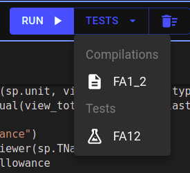
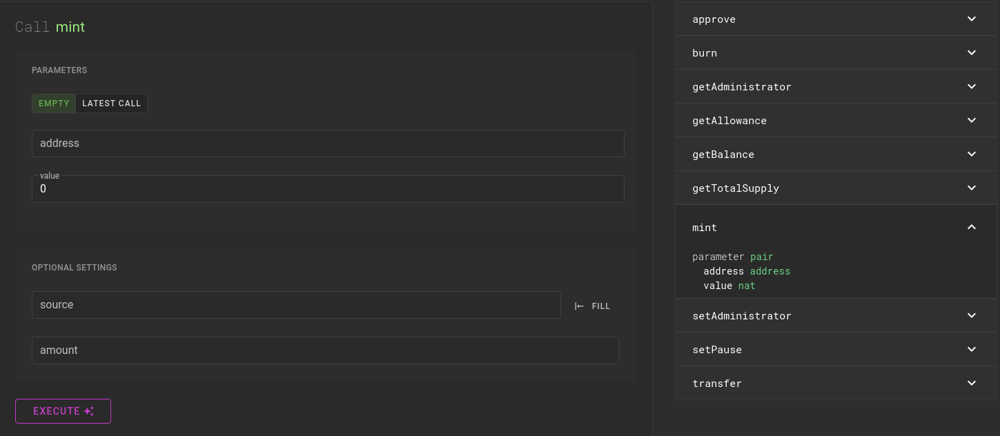

# FA1.2 (Fungible Token)

In this module, you will learn about fungible token assets on Tezos using the FA1.2 standard.

FA1.2 standard is defined under [TZIP-7](https://tzip.tezosagora.org/proposal/tzip-7/). It describes a smart contract which implements a ledger that maps addresses to balances. This ledger implements token transfer operations, as well as approvals for spending tokens from other accounts.

Using FA1.2 standard, you’ll be able to create your own cryptocurrency on the Tezos blockchain.

Here are the main features of an FA1.2 contract:

## Entrypoints

- `**transfer**`
    
    It allows the transfer of tokens from one address to another. It requires 3 parameters:
    
    - `from` - Address of the sender
    - `to` - Address of the receiver
    - `value` - Amount to be transferred

- `**approve**`
It allows users to give approvals to other addresses to spend some amount of their tokens. It requires 2 parameters:
    - `value` - Amount to be approved
    - `spender` - Address of the spender
    
    <aside>
    🔑 Changing [allowance value](https://www.notion.so/Glossary-e9a82a9d0faa4d279ecee6faa6b3e7c5) from non-zero to non-zero is not allowed for security reasons. It will give you the following error: `UnsafeAllowanceChange`
    
    </aside>
    

Further, there are three views named `getBalance`, `getAllowance`, and `getTotalSupply`.

## Token Metadata

Token metadata is intended for off-chain, user-facing contexts (e.g. wallets, explorers, marketplaces).

Token metadata for [TZIP-7](https://tzip.tezosagora.org/proposal/tzip-7/) should be presented in the same form as [TZIP-12's token metadata](https://tzip.tezosagora.org/proposal/tzip-12/#token-metadata). 

Token metadata is stored in a big_map named `token_metadata` that maps `token_id` to its metadata. The `token_id` used for FA1.2 tokens must be `0`.

The metadata is stored in a map that maps string fields to values in bytes (hexadecimal).

<aside>
💡 Michelson only supports printable characters of ASCII. So, to extend support for other languages, the string is encoded into bytes.

</aside>

There are 2 ways to define the metadata:

- **Store it on-chain**
    
    In this case, the metadata fields are stored directly in the metadata map. It includes the following fields:
    
    - `name` - The name of the token
    - `symbol` - The symbol of the token
    - `decimals` - The number of decimals in the token amount.
        
        > A decimal field is used to avoid the need for floating-point calculations inside the contract. So instead, the amount of tokens is divided by 10^decimals when shown to the user. For example, if you send 10.5 tokens that have 6 decimals using a wallet, the wallet converts it to 10,500,000 and the same amount is transferred internally in the contract, but the receiver also sees 10.5 tokens in his wallet as the amount is divided by 10^6 again in his wallet.
        > 
    - `thumbnailUri` - This should be a URI to the icon of the token. It can be an HTTP or IPFS (ipfs://Qm.. ) link.
    
    ```python
    {
    	"name": sp.utils.bytes_of_string("Token X"),
    	"symbol": sp.utils.bytes_of_string("TKX"),
    	"decimals": sp.utils.bytes_of_string("9"),
    	"thumbnaiUri": sp.utils.bytes_of_string("ipfs://Qm.. or http://..")
    }
    ```
    

- **Store it on IPFS**
    
    You can also store all the fields in a json document on [IPFS](https://docs.ipfs.io/) and store only the link to that document on-chain. This will considerably reduce the storage cost of blockchain.
    
    For this, you need to store the IPFS link against an empty string key in the metadata map.
    
    ```bash
    {"": sp.utils.bytes_of_string("ipfs://QmT1Zj1oRm7RzFT8Dap7FyvDK5ENq4eEhcFUS54aLqvpdf")}
    ```
    

<aside>
💡 Learn more about IPFS here → [IPFS (InterPlanetary File System)](https://www.notion.so/IPFS-InterPlanetary-File-System-15339af29f924606b4c147f89d36e25a)

</aside>

## FA1.2 Template

<aside>
💡 The smartpy FA1.2 template can be found [here](https://smartpy.io/ide?code=eJzVHO1y28bxv57iCk0bMCEhUUlsR1N7KjuS67aSHUtK06oe@ggcScT4KgBaplNn8iDt3z5YnqS794U74EBSitxpMRqRAm73dvf26_YW2iUny2weTxNGjqqK1RUZkZOj8cHOLnmWVUVcsohMV2RR10V1uLc3j@uEToMwT_fq93Ehfk2TfLqX0qpm5d7RHkAHB0Ea7ezEaZGXNalSWtbFitCKVMXODmC@WDCSsppGtKZkypL8msQV@X5Z1YRmhL2jaZGwIYkBlpVvWYWgMJBWbAjQNUCHeVazDKilJSPLCoisczJdxknEH2vkfzh_fgZ3aI2DygqgQ5ghzJGcLCLLIskph3324uQ82Ln467MX43uTUwk@eQxTkofkhx0Cl5fRlHlEX4fEO0fWXqwI55lc5G9YRi4YUE9r5g0FVMSqsIyLOs4zT0AdCwb1SDLLS2RcYHkCrJU0rMmszFMiZ1DI6LJe5GXlaRKudhQ5mpiv2VtATVPyW5bSOPldlMNHhmv2yOOjX0lkizxlBZ0rnoAytcxyyYI4VxPHIO9yRkMm5rYmRqmN9vfvjw72D8aj_S9G4_sSzHg8vmc@VnR8QHU4ggVJEhaiiEg@I6wsQSApqyogrhLLG2d63VE4wU6Y0Kriqjo5xvGHHGXEZiSlb5hfDQ5JyeplmRHf44KdeOQzUg12@LizvD6KUkDacz0UWDw1zhtwMDCJ5WwWhzHo3mOa0CxkTjDHOInhMqvojB0loPN498mCZnPmwOAcJ3G8oFwkvZfCIcZJIOQEsfUBmhyLcQAIq7MLPwR@0CZGL8p8XtIUBDJHPZ3F82VJcdnkODTs13xNQv70NRHLtMiTqNKWOSoMNKGJJkA8xsqKh83STiZxFteTia@1q2LJrNG1almgy5ksC8AfUfBqE@0KGkZPaIKeRN0AIU1qNF09dpLPZuECjGbyNmbXAuiiXEqYwaE1e7Bu0ofrSNJodsmfFwykU1o63ngx9FlT8HMaBQH7yHKwAgtDxokET5kB0aB55arIwW7J65Brj573NbmOkwQx0ihiUbBj87NRHg83isyg61kWJssIKJbPCUfBPV4I3qRCHUCuObqGZb9kf19C9KmIch9duYB@WrqSpnnW6EqWlylN4vcN3z5Xlga8WUfP8_R3vH7PkgJWY7bMhFPSwcUOLH5Vl0j_w0cQI2tWDQInRmT2DVuhD1Pwh9Z06u4VjHqFOlMEyzpOqoBjBdFOxES@NXDQrJv0dFqxbLmU4A6LQMWVoSmugcO2hJSE6Q3Jp5@ydwAHFOQluOO28othQLP40lIlxOhbrE6FN6wEl9N4Pklp4ddvabJk4t7FSwYkRz4twE3AfTn04hTG4edRFIFaVEN@84zWg6FCKgfivcHQmrXOa5qcgyUmKxi0bz9scaifSfn@DnByY5pwa9LyApCsmrFSyqug4NEqUzxFAPnUpF4VzBcPhyZ7GN0nkmLNUp13bpmSQc6ChK7yZe37nsAAqRF@8YYQ5xAc_q4hahOPA3oDuEyS3rIynq18sTrVhGJwi0G7KDDvc5KziJUD8g9LRP6PCqDgMcUfkN9YA_ggyWYgWXtIevGJ8Rwn6mugtOLKxPAq0CpwpTG9Io8eSlkHnEPgb2ikAUETvwa2LoKvk0J9Njtj6HpoubJIvgkAiLpXrutYUqra4sJiwZE9tEjbZgYuflpNMlpvT9bIlu0Ws4IgGvDPbK5MAcUzYuvHryz9@I2hY31KObC95u3U50ZicWJoy2itlxAY2C2dRFXwObf3CRLAsv9ttLoRskOpO8ZvaavIMhs4mpSMRqsjwXiEZHbF3IizkXEwZ7VSEcnHkOy7CPI7c4BTBx@jNUwKCO9atDqz6rVa7iL0yiYSdcrS@mbx3bLmqkDFA1sXwEh@dFCBUbaG3Knyu1A9dMuBUt9LoU6Na9gfEjO@_vDBUGORemCa5isF0xzBEkmPtEajgYt1PHRAJBjQu0zWGKV2M5ZKMMjle1EVAZr5_mB77rRu_FL@gvw6A3O6MZcCbrNZfEwhXDTp0k0d1yVkfBZpHX6NXExShCWduMISEOxpcKoaqwC4KahqmkW0jCD7rtUuSG6osOSzKPPlfAF5NWyd4hqlGGg2GneFUxuUy1wZs888T3y@GfzIhLQCGpeodLcb6TIyeUBST6YwyNeJvYTviz4IccvQIx3IptBzm@Syk6_huJskX8oLbpGeKD@4OUVxKWhn9Fpp86X5v5P2FrlrR4gfIXvtzLFdotYB25zB2ptB1yTmiE62ZxikLfK2Ud7G@GW6Z@ZMFvx6BQQNO3LMtrUyHnXs6k5tusuOzpx6Q5NFkorRv4THzQHKotBecB5R@hZ6fbjR6MWwjQvJ0@qbMvcYIsdHXT1BvLFshnDsgmBHSmZF7PzF8ZPD9YdKI@tYCXKhIq8gJPKHo_GB@gzSaJdPPGqKX2oWfh4zgpwpjMEfNbU7iO9Y62ERoGUgAQzh_ITpNA4XkErlmXS8GPxBxMRPaUFkrU8V@vQsR2TGrlWe8IatxJkUIi5xa4LHTDANrGqcseiwgXv0SEiF6OuQnC_yZRIRkBrAF3nGj6ZoUwK9fPmMXC@ASsL1pRKPeS2yZJIZqo5RdFW1W3oxLiWVoEOZcdylKcOaMbm8OBk9UPKYx2_xg5Kff_pnFFcFbEUJQv7807@QOk1EF3@1Sqd54m3Aj8VTnoEt8CwxjoBDWE1wkiaHxGfBPCDfXfx1SI4vXw6BmH8PujNGoAkpKJHXmjEjeLw1B6Q@ZPFgMzWTkrdIiTMiMQzkKohVFScboJ@xEn33whESWKwdP9HitOuSKLIqRVgsS8AHuwrLdKRraFva1mXtc9T6RmrNMQVX9wpJomQaz0eo7zSDJJiiJH5tj7ZQahORpVxY@xq34THIEr9K2DgaCCtSf2ez3LaoQU_xXBxJFDAx4wXqmCaqUmtXllssWfXljgX84LSJ_UNjs6wIF7tlg2wZnB3nC3oJBh30H4adWzWeCejczvHcURQ3iFJwLdKMSvk5l6@MDELI1iTNX@2TFHFS8F_y5ffUJ28aUGgvcCcmiMpnM1ZWBDMDWH_GvZ6wPO5dwSLWHBJ1LWjOYION6oTTju_ZdmRYD@YgmJFfvWqo4oV_l_VpNbe34W0L1JwB@CKP1EEciIu7IfuQLJ7Z54EQeo3jMKc54oUykXB4NPN602Hdax4QQYgg1ouXl8eG31TXS5HEaM@hgy2PSMpFQyhg0qkFpFHVFPs6wM3uD7qIT_AcEGIXLDDD7D3GxohURbEhiVYQS@JwJNaiYizlZ3HciXWQpTlMNEvYO97OEi7yWO3D@5bDzKMUvc3B0sbSjS3VK4XBPJlTtaIlHnTyhEQ1l0jd1WdoG89dHTU_l8@zYHwIJEydXpMoD@G79xQNhoceRYs38G1UNu9C@rAXvnLMaliHQYjtYD_91NVZY7s8j8_SpEOHYlo95oPjbLGxQk9984bm@TCOVlGz69a2DZznILCOY_ll0codp24QWBw6JvVoTceBrUIoGElrSyQQmWTxoeXPHMLR11Emmg5GIr_B_AmLqT09DcKMxfSRw@Xg9UQU2kqW8ir_dVwvrPYSf33rhejzIEEQDF5vxcWdbZgsdeCuon3Ebxef9NjWcgjtMHaIfmuAFbiFhtmlwmFzz@LFuM_3dMbftnkbDzoGZD0r2U5_NwGfu2kq6PitszxjQ9KZQD4xlFBPFvT0K@gdqlz9dr2BipUyjadFDURDnJT75y5F8qltFiWNK0aO34WM9_nZpg6a9rfuHky3@fHwKA8PCGTMCYM0Se1uZjmaEISOrhni9bd61CQEv25aKkUK300pNYy1M26iuSpk49StrF8h7VrqKW4qMP3ckAWuyQHvyw_Hbr4lyVYC23K83SAr9WD9cmO1v7uo_SgxmnaHOnZmfUEVqHBq1hpC3BGsc8cQya7INOEnzxLsdyUL3tbEG2thAaIlbjqb6UV@ly_rYomHHxlLDFRND@36DlqL5t5MW7utbyHEs9JsT@r3IbVZANPdRQlaC3eTGXoKR47AsztjD9VAXDwX5lqrU_LeXh9a4ilcXzVOe_kGdQUZvTrpxB7XS9mjDLuw2k7zKymKC3jyXD74VpY_Nwtl1qZjBvPDb4ekRPpqymotz2C8oAiqBMndfZf1qcpfsmgC9h2@8ZsV4OF66lDlmd_ssqVFcdXV@B2SNYnnsp3qgjwYk1fLVmrIH9GGQLSTCVahJpPmgIxG0QTF7@MDzIMxlnhNZZk_GxgVuipkGS1jua3GxxN1y2BT3QoWY9lpTBQ12Euvuusp7673Bl30Qc0Tl3w2UV3tvmXFam4ahvkSEitlVRU5_vrgyy_HX2G6NsKSSwV8gHcVAS8OIf1aNeLngc9gRaLzPauc7pmNHLE6hmkB4ANj4DSfEuIa@DKfsrL2LG7@xOpPKlXm4h5HDq8O3SI9ko89h8irRX7tX8nkgtM7RGpeuaSMuJQ9Gbg6qYi9czFrhrxFfvwAdhj2tUtO8XQYpLfCdyV4tRJCq43HenkA8JyuyNOSUbkT4zh3CXqoNMUUM7KhjVqpgH560SajH3oXMhNgm8xilkSVjTgOxWsJEvEn3TcA9ircjId7cTrfS_J5PsJoElRv558YWzP1zZXBtQTqIf1xMcNZvklpfHT5_fjk5OzpXy6WD8o_Pf4@_Jyxs6_C8z9e05MHx09PH599nS7evzg7iYyXCowZxxjjdfarLq4T6nTQToRkXcS6HpLttxUY_Tv9pZYSSZSuRLpfUEQ00dp3je2e@qa9EuzHw3GPoj@3CkmjFimG@u_yuNOpB5s93LkRlHAw70frRKtwHPRlO5qyks1jhPe7KAdrpgtUKJILAFOZ4QgLtI7JxE5uwv6@pImtG44ZjBhjr5MKN669ogxhzizbqh6vG6HLtrj_d5el8Wr7od4WcXRQA_eMHE_LD_XjaTmodThb3mkNTnBb6xC1vFEvohu5qe62HK8P3dtrquPqqx2Zagz0vNIhtuXEYWAtfbS1RWpyUx3wvFeycbpHgrdznAOHH4G528UfcSDheVbjCSfB9_bf7e97g0FQLrHHRXal0tY5cYvXNezZWHsEfIxpqTzqdIl0cSCzF97ohCe4eBQbwnhzOFDB@6CaHhueKejgoJkdH6xnb2tEn_938Nhy4NmaeimBn5E8zqe2GPQrC@rlg9a84vUDSKC6pHzRJgUhN698049qzmQ0@YDUv@jhCMgHfuR5jyJdvBUpmMVePDxWzVmVfQJf6VtG8CUq1Tr50ZiHQfxhrOtMaxdF9oBXuCB80yw4kytlU6n7xQtjsi5FX65fjjtnd5slArLLkWOd_geWgfsILIeKNahFRDPJ4r17jUE65x_fzvttYwOuBMa0ailipPJOORBbpu1lyKurlV3SR40WdIa8Z6CxVZqt0rxsKYDubeJ59CZHedcuazOzd7l6XGaNT75exPjuphTjndnFtnrZkLTM@hZSkSFfraf6VWDXCgoRfiyj@OqjyUc4y400Wo2igOb@nbD14AZYDHbaonFnTN_yM9Q@b229iY4X7vMmTcNtU421z7_NLacJYq6P8WaI305nDJAAq7FRIAqqg15RyG2bBakrrEO9K3vgTh0P@otaHGP7TMjgu9sC2@bd7se1JWB3piLCZRbXQwfgLeRgwzukYdU8eiXDX@4gQq3bgrFbo7dWBwOsJRDzTZKWOAygWwjDhHaIAmy1VzPUGz4drVAPbsK6Bmprgn6PyCh281d7uq7LmesNhq0JbqMxGtYlIiUhWRrHIkuc8L6biTzv0HNgXXtyYNTfegpuRJaBJQ@@V78fn3715PS4rr5LP__m3dH9k_T08uCbxf1376vl0@@@nYZfl@2KgKrP2TW5bgFmq__10PzbBvPa_l8@2CWBtVW_dqWTC25j@Xib4jHHtLGA3F8A5vAbS8jr4dcUkTn6Oykk4_VhU6HUKec7qSrz6VulksHOfwA2P0B3)

</aside>

This template contains all the features as defined in TZIP-7. It can be used to easily deploy your own FA1.2 token with minor or no modification.

The template has heavy usage of classes and inheritance that makes it very flexible to edit.

 For example, the default `transfer` entrypoint allows the [administrator](https://www.notion.so/Glossary-e9a82a9d0faa4d279ecee6faa6b3e7c5) to transfer anyone's tokens. If you don't want that to happen in your token then you can remove that condition as follows:

```python
@sp.entry_point
    def transfer(self, params):
        sp.set_type(params, sp.TRecord(from_ = sp.TAddress, to_ = sp.TAddress, value = sp.TNat).layout(("from_ as from", ("to_ as to", "value"))))
        sp.verify(~~self.is_administrator(sp.sender) |~~ # This condition allows admin to transfer anyone's tokens
            (~self.is_paused() &
                ((params.from_ == sp.sender) |
                 (self.data.balances[params.from_].approvals[sp.sender] >= params.value))), FA12_Error.NotAllowed)
```

## Compiling the contract

Before compiling and deploying you might want to edit the metadata of your token. You can do that in the compilation target at the end of the template.

Set the admin address to your wallet address and replace the token_metadata IPFS link with your own IPFS link to change the token metadata. This will affect the appearance of the token in wallets and other dApps.

```python
sp.add_compilation_target(
  "FA1_2"
  FA12(
      admin   = sp.address("tz1M9CMEtsXm3QxA7FmMU2Qh7xzsuGXVbcDr"),
      config  = FA12_config(
          support_upgradable_metadata         = True,
          use_token_metadata_offchain_view    = True
      ),
      token_metadata = {
          "" : "ipfs://QmT1Zj1oRm7RzFT8Dap7FyvDK5ENq4eEhcFUS54aLqvpdf",
      },
      contract_metadata = {
          "" : "ipfs://QmaiAUj1FFNGYTu8rLBjc3eeN9cSKwaF8EGMBNDmhzPNFd",
      }
  )
)
```

Now, run the code, and then under "TESTS" dropdown select the "FA1_2" compilation target. It will compile the code according to the compilation target as defined above.



For **deploying** you can refer [here](https://www.notion.so/Deploying-and-interacting-with-smart-contracts-7652d420c6474cc88696b5139eeba344).

## Minting some tokens

- Go to [better-call.dev](https://better-call.dev/) and enter your contract's address.
- Select your contract from the results and go to **Interact** tab.
- Select the `mint` entrypoint, enter the required details as given below:
    - `address`  - The address that will own the minted token
    - `value`  - (Amount of tokens you want to mint) * (10^decimals)



Finally, you can go to your wallet and you will find the token you just minted.

