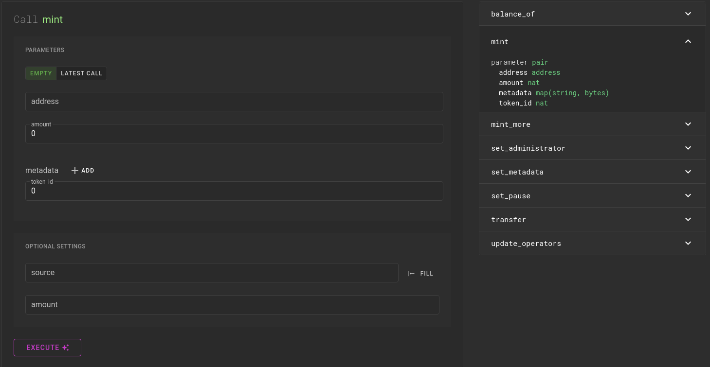

# FA2 (Fungible and Non-Fungible Tokens)

In this module, you will learn about multi-asset tokens on Tezos using the FA2 standard.

FA2 standard is defined under [TZIP-12](https://gitlab.com/tezos/tzip/-/blob/master/proposals/tzip-12/tzip-12.md). It proposes a standard for a unified token contract interface, supporting a wide range of token types and implementations. It provides a standard API to batch transfer tokens, check token balances, and manage operators (addresses that are permitted to transfer tokens on behalf of the token owner). It also specifies metadata at the token and contract level based on [TZIP-016](https://gitlab.com/tzip/tzip/-/blob/master/proposals/tzip-16/tzip-16.md).

Using FA2 standard, you’ll be able to create your own NFTs (non-fungible tokens) as well as fungible tokens on the Tezos blockchain. 

Here are the main features of an FA2 contract:

## Entrypoints

- `**transfer**`
    
    It allows the transfer of tokens from one address to another. It requires the following parameters:
    
    - `from_` - Address of the sender
    - `txs` - A list of all the transactions containing the following details:
        - `to_` - Address of the receiver
        - `token_id` - token_id of the token to transfer
        - `amount`- Amount to be transferred

- `**balance_of**`
It is used to get the balances of multiple addresses from another contract. It requires the following parameters:
    - `requests` - A list of requests containing the following details:
        - `address`
        - `token_id`
    - `callback` - The contract to which the result will be sent

- `**update_operator**`
It is used to add or remove the operator. Operators are permitted per specific token owner and token ID (token type). Once permitted, an operator can transfer tokens of that type belonging to the owner.  It requires the following parameters:
    
    A list of variants with one of the following types:
    
    - `add_operator`
        - `owner`
        - `operator`
        - `token_id`
    - `remove_operator`
        - `owner`
        - `operator`
        - `token_id`
    

## FA2 Template

<aside>
💡 The smartpy FA2 template can be found [here](https://smartpy.io/ide?template=FA2.py)

</aside>

This template contains all the features as defined in TZIP-12. It can be used to easily deploy your own FA2 token with minor or no modification.

This template can be configured by changing the parameters in `FA2_config` as shown below:

**NFT contract**:

```python
sp.add_compilation_target(
  "FA2_comp",
  FA2(
    config = FA2_config(non_fungible = True, store_total_supply = False),
    metadata = sp.utils.metadata_of_url("https://example.com"),
    admin = sp.address("tz1...")
  )
)
```

**Multi-asset fungible token contract**:

```python
sp.add_compilation_target(
  "FA2_comp",
  FA2(
    config = FA2_config(),
    metadata = sp.utils.metadata_of_url("https://example.com"),
    admin = sp.address("tz1...")
  )
)
```

<aside>
💡 For single asset FA2 contract, set the `single_asset` property of `FA2_config` to true.

</aside>

For compiling and deploying, refer [here](https://www.notion.so/FA1-2-Fungible-Token-8cc9284484094a38a43a305c46c3d562)

## Minting FA2 Tokens

The `mint` entrypoint of FA2 contract requires the following parameters:

- `address` - The minted tokens will be sent to this address
- `amount` - The amount of tokens to mint. Keep the amount as `actual amount * (10^decimals)`.
- `metadata` - It is a map containing the token metadata as explained [here](https://www.notion.so/FA1-2-Fungible-Token-8cc9284484094a38a43a305c46c3d562). The easiest way is to use an IPFS link. Keep the string field empty and fill the bytes field with hex-encoded ipfs link (ipfs://Qm...). For example, `ipfs://QmSaEnhQXXKw4EmkLztnsjpryQFNWZvAffRpHHycSCoUpU` This is an example token metadata you can view its content [here](https://cloudflare-ipfs.com/ipfs/QmSaEnhQXXKw4EmkLztnsjpryQFNWZvAffRpHHycSCoUpU). Its hex-encoded string is: `697066733a2f2f516d5361456e685158584b7734456d6b4c7a746e736a70727951464e575a7641666652704848796353436f557055`.
- `token_id` - A unique id of the token. By default, it should be consecutive starting from 0 for the first token.

<aside>
💡 Learn more about IPFS here → [IPFS (InterPlanetary File System)](https://www.notion.so/IPFS-InterPlanetary-File-System-15339af29f924606b4c147f89d36e25a)

</aside>



<aside>
💡 In an FA2 contract, by default, it is not possible to mint more amount of the same token. One way to do it is to implement another entrypoint like the `mint_more` entrypoint in the image above.

</aside>

Now you can view your minted tokens in your wallet.
