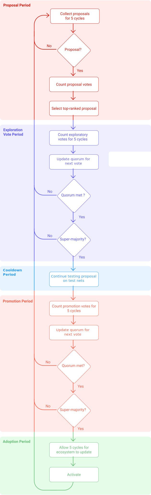

# Governance on-chain & Voting

## What is self-amendment?

Tezos is a blockchain that has a unique feature which improves itself over time by using a formalized process of upgrading to its protocol. In theory, this workflow is similar to how shareholders in a corporation work where they get to vote on a future direction for the corporation.

Formal governance structure in this case does not exist in many other blockchains. As a result, new projects are often decided by a small group and imposed on the whole ecosystem. This process can potentially result in hard forks when participants don't agree with the decisions. Hard forks can split the chain into two or more chains that can co-exist and split the community. Thus, Self-amendment aims to avoid this scenario, by allowing token holders to vote on the future development of the blockchain.

## Definitions of the main concepts

- **Baking**: Validator nodes or “bakers” receive compensation as a reward in tez for each new block produced and created.
- **Endorsement**: Other bakers who are not chosen to bake the current block will validate the baked block and receive compensation in tez.
- **Delegation**: Holders of tez tokens can delegate their baking and voting rights to delegates (bakers) while still in control of their tokens.
- **Roll**: An amount of Tez which is used as the unit of measure for baking and voting rights. Weight in the baking and voting process is indexed to an integral number of rolls. At present, one roll is equal to 8,000 Tez.
- **Cycle**: The time equal to the creation of 4,096 blocks' on Tezos (around 2 days, 20 hours, and 16 minutes (1 minute per block, if all bakers cooperate effectively)).
- **Proposal**: A request for addition, adjustment, or removal of a protocol's feature.

## How does it work?

The self-amendment process is composed of five periods:

1. *Proposal Period*
2. *Exploration Vote Period*
3. *Testing Period*
4. *Promotion Vote Period*
5. *Adoption Period*

Each of these five periods lasts five baking cycles (i.e. 20,480 blocks or roughly 14 days), taking almost two months from the proposal to activation. The latest and current self-amendments are available at [tezosagora.org](https://www.tezosagora.org/).

Should there be any failure in a given period, the whole process will revert to the *Proposal Period*, effectively aborting and restarting the process.

## Phase 1: Proposal Period

The Tezos amendment process begins with the *Proposal Period*, during which delegates can submit proposals on-chain. The delegates submit a proposal by submitting the hash of the source code.

In each *Proposal Period*, delegates can submit up to 20 proposals. **A proposal submission also counts as a weighted vote** (proportionally to the number of rolls in their staking balance at this moment). Other delegates can then vote on the submission up to 20 times.

A submission must receive **a minimum of 5% of approval** to access the next stage (2. *Exploration Vote Period*).

At the end of the *Proposal Period*, the network counts proposal votes, and the most-upvoted submission proceeds to the *Exploration Vote Period* (2.). If there are no proposal, a tie, or less than 5% votes, then a new *Proposal Period* (1.) begins.

## Phase 2: Exploration Vote Period

In the *Exploration Vote Period*, delegates may vote for the top-ranked proposal from the previous *Proposal Period*. Delegates get to vote either *Yea*, *Nay* or *Pass* on a specific submission (voting rules are explained in the previous "*Super-majority*" and "*Quorum*" sections). If the voting participation fails to achieve the *Quorum* or the 80% *Super-Majority*, the amendment process restarts from the beginning of the *Proposal Period* (1.).

## Phase 3: Testing Period

If a proposal is approved in the *Exploration Vote Period* (2.), the *Testing Period* begins with a **testnet** fork that runs in parallel to the mainnet for 48 hours. These forks have access rights to the standard library but in a *[sandbox](https://en.wikipedia.org/wiki/Sandbox_(software_development))* (at node level).

The purpose is to verify that the migration from the old protocol to the new one works correctly. This 48-hour duration has been conservatively set to reduce the risk of the network perceiving the testnet fork as the main chain. However, 48 hours of testing is too short to determine whether a proposal is worthwhile and a safe amendment or not. A testnet matching the amendment proposal is likely to run off-chain during the remaining ~7.3 cycles of the *Testing Period* to find security vulnerabilities. These extra cycles allow stakeholders to evaluate and discuss the amendment and gain better knowledge of its properties.

## Phase 4: Promotion Vote Period

At the end of the *Testing Period* (3.), the *Promotion Vote Period* (4.) begins. The network decides whether to adopt the amendment based on previous off-chain discussions and its behaviour (in 3.). The voting rules are identical to the *Exploration Voting Period* (2.) (settlement in the "*Super-Majority*" and "*Quorum*" sections).

At the end of the *Promotion Vote Period*, the network counts the number of votes. If the participation rate reaches the minimum quorum and an 80% *Super-Majority* of non-passing delegates vote in *Yea*, then the amendment proceeds to the *Adoption period* (5.). If not, then the process reverts to the *Proposal Period* (1.). The minimum vote participation rate is based on past ones.

In exchange for their work on the proposal, some delegates can put a symbolic self-reward into the new protocol. If the new protocol is accepted, they will receive the reward.

## Phase 5: Adoption period

*Adoption period* provides enough time to enable the ecosystem and update the dev tooling.

After this phase, the mainnet activation is complete.

At the time of writing this (March 2021), 43 periods had passed. There were 8 submitted proposals of which 6 validations.

## Amendment Process Diagram[#](https://opentezos.com/tezos-basics/governance-on-chain#amendment-process-diagram)

The diagram below sums up the self-amendment process:

FIGURE 1: Self-amendment process

Source: Open Tezos