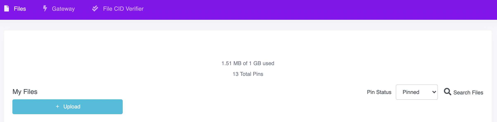

# IPFS (InterPlanetary File System)

The InterPlanetary File System is a protocol and peer-to-peer network for storing and sharing data in a distributed file system.

IPFS uses content-addressing to uniquely identify each file in a global namespace connecting all computing devices. In simpler words, Every file on IPFS is addressed by a content-identifier (CID) hash derived from its content. If the content of a file is changed, its hash changes. This implies, if we have the IPFS address of a file, we are guaranteed to get the same data forever.

<aside>
⚠️ IPFS does not guarantee the availability of data. If no IPFS node is hosting a file anymore, it will not be available on the network. But if the same file is hosted again by any node, then the same IPFS address can be used to access the file.

</aside>

<aside>
ℹ️ Hosting of a file by an IPFS node is called pinning.

</aside>

As you might have realized till now, storage on the blockchain is very expensive. It is not ideal for storing large amounts of data.
IPFS comes to the rescue here. Generally, files are stored on IPFS, and their addresses are stored on-chain.

For instance, in the case of NFTs, the IPFS link of its metadata is stored on-chain in `token_metadata` bigmap according to FA2/TZIP-12 standard. The metadata of the NFT is a JSON file on IPFS. Further, the `thumbnailUri` in the metadata is also generally another IPFS address pointing to the thumbnail of the NFT on IPFS. Contract metadata is also stored similarly on IPFS and linked to the `metadata` bigmap of the contract.

## Setting up an IPFS node

Use IPFS Desktop App or CLI tool to set up an IPFS node on your personal computer. The CLI can also be used to host a node in a remote server. Find the instructions [here](https://docs.ipfs.io/)

## Using a third-party IPFS service

If you don’t want to host and maintain your IPFS infrastructure, you can use one of the many IPFS pinning services.

[Pinata](https://www.pinata.cloud/) is a popular IPFS pinning service that allows pinning files to IPFS for free.

### Pinning a file to IPFS using Pinata

1. Sign up for Pinata [here](https://app.pinata.cloud/).
2. From the Pinata dashboard, click on the upload button to upload a file.
    
    
    
3. Select any file to upload.
    
    <aside>
    ⚠️ Remember IPFS is a public network, do not upload any personal/sensitive data to it.
    
    </aside>
    
4. After the upload is successful, you should see the file listed under the upload button along with its CID.

## IPFS Gateways

An IPFS gateway makes it possible for users of web 2.0 to access the data stored in the IPFS network. Some of the most popular public IPFS gateways are:

- [https://ipfs.io/ipfs/](https://ipfs.io/ipfs/)
- [https://cloudflare-ipfs.com/ipfs/](https://cloudflare-ipfs.com/ipfs/)
- [https://gateway.pinata.cloud/ipfs/](https://gateway.pinata.cloud/ipfs/)

Append any IPFS CID to any of these links to load the content of the file in your browser.

For example, [https://cloudflare-ipfs.com/ipfs/QmT78zSuBmuS4z925WZfrqQ1qHaJ56DQaTfyMUF7F8ff5o](https://cloudflare-ipfs.com/ipfs/QmT78zSuBmuS4z925WZfrqQ1qHaJ56DQaTfyMUF7F8ff5o)

## Using IPFS with Tezos

You can use IPFS to store images or other multimedia files along with a TZIP-16 or TZIP-21 standard JSON. The CID of the JSON can be stored on-chain as metadata of contracts and tokens.

<aside>
💡 TZIP-16 standard requires appending `ipfs://` to CIDs. So, `ipfs://QmT78zSuBmuS4z925WZfrqQ1qHaJ56DQaTfyMUF7F8ff5o` is the correct IPFS URI.

</aside>

Refer to [FA1.2 (Fungible Token)](https://www.notion.so/FA1-2-Fungible-Token-8cc9284484094a38a43a305c46c3d562) and [FA2 (Fungible and Non-Fungible Tokens)](https://www.notion.so/FA2-Fungible-and-Non-Fungible-Tokens-32fd74a2f60043d0a614d6a9a3beda70) to know more about the contract and token metadata.

