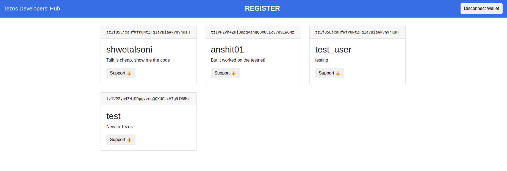

# Integrating with frontend

In the last section, you learned about **Deploying and interacting with the contract.** Now, you will learn to **Integrate your contract with frontend using Taquito and beacon SDK**. In this section you will learn the following:

- [Connecting wallet](https://www.notion.so/Integrating-with-frontend-544c2a256d164a4a9f2e927c165b2f45)
- [Accessing storage](https://www.notion.so/Integrating-with-frontend-544c2a256d164a4a9f2e927c165b2f45)
- [Interacting with contract](https://www.notion.so/Integrating-with-frontend-544c2a256d164a4a9f2e927c165b2f45)
- [Transfering *tez*](https://www.notion.so/Integrating-with-frontend-544c2a256d164a4a9f2e927c165b2f45)

 Let's get started.

> NOTE: In this tutorial, we will be using the Taquito library in a React project. So, if you don't have experience with javascript, check out [PyTezos](https://www.notion.so/PyTezos-031e229490c649e0b36c06d9cdcdb5c7) for Python or [tezster-dart](https://github.com/Tezsure/Tezster_dart) package for Flutter.
> 

## 1. Clone repository

You can clone the T**[ezos-Starter-Project](https://github.com/Anshit01/Tezos-Starter-Project)** repository by using the following command and navigate to the respective directory.

```bash
git clone https://github.com/Anshit01/Tezos-Starter-Project.git
cd Tezos-Starter-Project
```

## 2. Install dependencies

For installing the required dependencies for the project, run the following:

```bash
npm install
```

## 3. Tezos setup

The `tezos.js` file in `src/` folder will contain all the tezos related code. Follow the following steps.

1. **Update configurations**
    
    You have to provide the contract address for the contract you deployed. If you haven't deployed any contract then you can use the default contract address as provided in the code. Also, you can change the `RPC_URL` and `NETWORK` in case you have deployed your contract to any other testnet.
    
    ```jsx
    // Update CONTRACT_ADDRESS and other constants below as required
    
    const DAPP_NAME = "Tezos Developer Hub"
    const RPC_URL = "https://granadanet.smartpy.io";
    const NETWORK = "granadanet"
    const CONTRACT_ADDRESS = "KT1VpKSj44yAVShjPt5AAXksaMYn3xKsB46c"
    ```
    

1. **Initialize TezosToolkit and BeaconWallet**
    
    Import `TezosToolkit` from taquito and initialize it with `RPC URL`. RPC is the node that connects taquito with the blockchain. The initialized object will be used to perform contract calls, read contract storage, and transfer *tez.*
    
    ```jsx
    // Initialize TezosToolkit
    
    const Tezos = new TezosToolkit(RPC_URL);
    ```
    
    Create an instance of [Beacon Wallet](https://www.notion.so/Wallets-4e9996a6d10a42bb885c387edd289923). This will allow you to connect with user wallets.
    
    ```jsx
    // Initialize BeaconWallet
    
    const wallet = new BeaconWallet({
        name: DAPP_NAME,
        preferredNetwork: NETWORK,
        colorMode: 'light'
    });
    ```
    
    Link the wallet to Taquito TezosToolkit instance.
    
    ```jsx
    // Setting the wallet as the wallet provider for Taquito.
    
    Tezos.setWalletProvider(wallet)
    ```
    

## 4. Connect wallet

1. **Connect with wallet**
    
    In the `tezos.js` file, create `getActiveAccount()` function. This function requests permission from the user to connect with the wallet or checks if the permission is already granted. Once the permission is granted, it returns the `activeAccount` object that contains the user's wallet address.
    
    ```jsx
    // Create getActiveAccount function to connect with wallet
    
    const getActiveAccount = async () => {
        const activeAccount = await wallet.client.getActiveAccount();
    
        // no active account, we need permissions first
        if (!activeAccount) {
            await wallet.requestPermissions({
                type: NETWORK,
                rpcUrl: RPC_URL
            });
            return getActiveAccount();
        }
    
        return activeAccount;
    };
    ```
    

1. **Disconnect wallet**
    
    Create this function to allow the user to disconnect the wallet from your DApp.
    
    ```jsx
    // Create clearActiveAccount function to disconnect the wallet
    
    const clearActiveAccount = async () => {
        return wallet.client.clearActiveAccount();
    }
    ```
    

1. **Login using wallet**
    
    In `LoginButton.js` file, implement the login and logout using the functions created above. Use the `walletConneted` state variable to keep track of login status.
    

```jsx
// Login/Logout here

if(!walletConnected) {
    let activeAccount = await getActiveAccount();
    setWalletConnected(true);
    console.log(activeAccount);
}else {
    await clearActiveAccount();
    setWalletConnected(false);
}
```

## 5. Access storage

1. **Fetch Contract**
    
    In `tezos.js` file, create `getContract()` function, which will return a *promise* object for your contract. It will be used to interact with your contract.
    
    ```jsx
    // Fetching contract
    
    const getContract = async () => {
        return Tezos.wallet.at(CONTRACT_ADDRESS);
    }
    ```
    
2. **Fetch Contract's Storage**
    
    Create `getContractStorage()` function, that will return a *promise* object for your contract's storage.
    
3. **Fetch data from contract**
    
    In the `Home.js` file complete the `fetchStorage()` function to fetch the data stored in the contract. You can also `console.log()` the `storage` object below to see the complete storage.
    
    ```jsx
    // Fetch data from contract
    
    let storage = await getContractStorage();
    let devs = storage.devs.valueMap;
    let users = []
    devs.forEach(dev => {
        users.push(dev);
    });
    setUserData(users);
    ```
    

## 6. Interact with the contract

In the `Register.js` file, complete `handleClick()` function to call the register entrypoint on the contract with bio and name.

```jsx
// Register here

const contract = await getContract();
const op = await contract.methods.default(bio, name).send();
await op.confirmation();
alert("Registered!")
```

<aside>
💡 If the contract has single entrypoint, then it is named `default`. Otherwise, in case of multiple entrypoints, they are called with their respective names as specified in the contract code. So in that case, it can be called using the `contract.methods.entrypointName`. `console.log()`

</aside>

## 7. Transfer *tez*

In the `Transfer.js` file, complete `handleClick()` function to transfer tez.

```jsx
// Send tez

const op = await Tezos.wallet
    .transfer({to: props.address, amount: tez})
    .send()
await op.confirmation()
alert("Sent!");
```

## 8. Run the code

Congratulations! you have successfully created your first tezos DApp. Let's run to see what it can do.

```bash
npm start
```

On running the server, you will see this page as shown below:



You can click on **Register** button to get yourself registered on **Tezos Developer Hub**.

# References

You can find the complete frontend code **[here](https://github.com/shwetalsoni/Tezos-Starter-Project).**

> **Note** ⇒ [SmartPy Cheatsheet](https://www.notion.so/SmartPy-Cheatsheet-c9d12639a93a436e9d76cd0b664e6079)
>