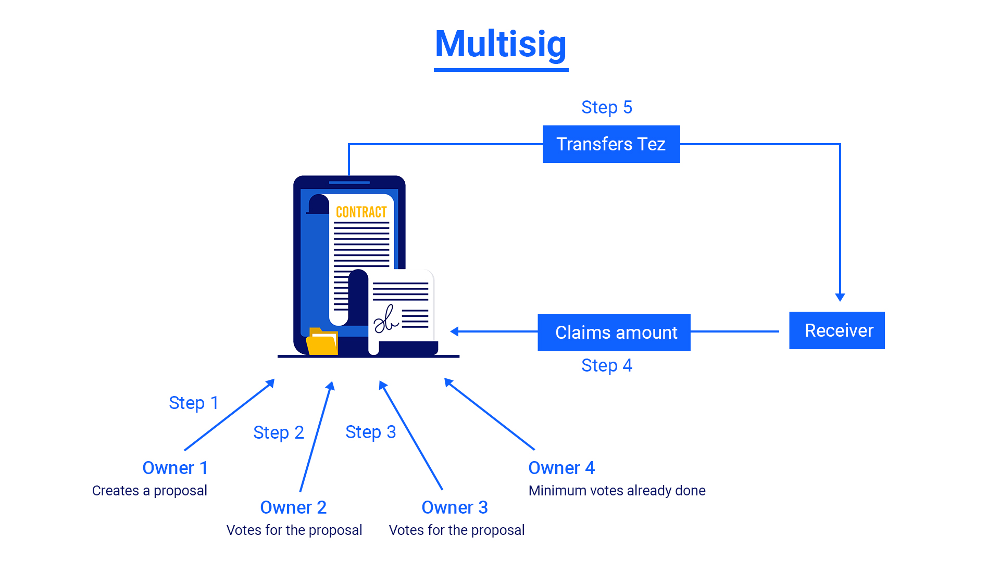

# Multisig

In this module, you will learn about multisig contract, its importance, and how to write a multisig contract.

A multi-signed account, or multisig for short, is a way to share the ownership of an address (and of the associated balance) between several participants.

To act on a multisig, a fraction of the participants must agree on the action by signing it with their private keys. 

The minimal number of participants that need to agree for the action to be approved is called the **multisig *threshold***.

You can use a multisig contract to distribute ownership of some tokens or some permission to a group of people. Below is an illustration demonstrating the same.



The given contract has 4 owners (or stakeholders) and permission of at least 3 of them is required to execute any proposal. Assuming that the contract already has some *tez* balance, owner 1 creates a proposal of transferring some amount of *tez* to an address. 2 other owners need to vote in favor of the proposal to execute it. Once the quorum is reached, the receiver can claim the amount from the contract.

Now, you will learn to write the contract for multisig.

This contract will hold some *tez.* A proposal will be created for sending some tez to a particular receiver. The proposal has some defined owners. For making the transaction, the proposal has to be signed by the required number of owners.

<aside>
💡 This tutorial uses granadanet.
As tezos is upgradable, new testnets appear after every 3 months and older ones are made absolute. So, always use the latest testnet.

</aside>

# Let's Code

## 1. Initializing storage

The storage of the contract is initialized with a set of owners and minimum votes required.

It has a `proposals` big_map (similar to map) which contains key-value pairs. 

- The key is `proposalId` which is a natural no.
- The value is a record of:
    - `payment` - Amount to be transferred to the receiver
    - `votes` - Set of addresses of the owners who have voted
    - `receiver` - Receiver of the amount.

```python
import smartpy as sp

class Multisig(sp.Contract):
    def __init__(self, owners, votesRequired):   # initialized with set of owners and votesRequired
        self.init(
            owners = owners,
            votesRequired = votesRequired,
            proposalId = sp.nat(0),
            proposals = sp.big_map(
                tkey = sp.TNat,
                tvalue = sp.TRecord(
                    payment = sp.TNat,
                    votes = sp.TSet(sp.TAddress),
                    receiver = sp.TAddress,
                )
            )
        )
```

## 2. Writing helper function

This function will check if the person requesting the operation is among the set of owners or not. It is a reusable function.

```python
def isOwner(self):
    return self.data.owners.contains(sp.sender)
```

## 3. Writing entrypoints

1. **Adding balance to the contract**
    
    As this contract is meant to hold some amount of tez on behalf of the group of owners, so there must be a way to accept payments. **Default** entrypoint enables it to receive payments directly from users’ wallets.
    
    ```python
    @sp.entry_point
    def default(self):
        pass
    ```
    

1. **Creating a proposal**
    
    This entry point creates a proposal that consists of the following parameters:
    
    - `payment`
    - `receiver`
    
    This operation can only be done by one of the owners of the contract.
    
    ```python
    @sp.entry_point
    def createProposal(self, params):
    
        sp.set_type(params, sp.TRecord(
            payment = sp.TNat,
            receiver = sp.TAddress,
        ))
    
        sp.verify(self.isOwner(), message = "NOT_OWNER")
    
        self.data.proposals[self.data.proposalId] = sp.record(
            payment = params.payment,
            votes = sp.set([sp.sender]),
            receiver = params.receiver,
        )
    
        self.data.proposalId = self.data.proposalId + 1
    ```
    

3.  **Signing the proposal**

This entry point is the main function for multisig. Before issuing the payment, it has to be approved by the required number of owners. Only owners can call this entry point.

```python
@sp.entry_point
def sign(self, params):
    
    sp.set_type(params, sp.TNat)

    sp.verify(self.isOwner(), message = "NOT_OWNER")

    sp.verify(
        ~ self.data.proposals[params].votes.contains(sp.sender),
        message = "ALREADY_VOTED"
    )

    self.data.proposals[params].votes.add(sp.sender)
```

1. **Issue payment**
    
    This entry point issues the receiver the amount locked by the sender in the contract. This entry point can be called by either receiver or owners. For claiming the amount, the proposal must have passed the threshold value.
    
    After all the conditions are satisfied, the amount is transferred to the receiver and the proposal is deleted.
    
    ```python
    @sp.entry_point
    def issue(self, params):
    
        sp.set_type(params, sp.TNat)
    
        sp.verify(
            (sp.sender == self.data.proposals[params].receiver) | self.isOwner(), 
            message = "NOT_ALLOWED"
        )
    
        sp.verify(
            sp.len(self.data.proposals[params].votes) >= self.data.votesRequired, 
            message = "LESS_VOTES"
        )
      
        sp.send(
            destination = self.data.proposals[params].receiver, 
            amount = sp.utils.nat_to_mutez(self.data.proposals[params].payment),
            message = "ISSUE"
        )
    
        del self.data.proposals[params]
    ```
    
    ## 4. Writing tests
    
    1. **Defining tests and creating scenario**
        
        ```python
        @sp.add_test(name = "Multisig", is_default = True)
        def test():
            scenario = sp.test_scenario()
            scenario.h1("Multisig Contract")
            scenario.table_of_contents()
        
            admin = sp.test_account("admin").address
            alice = sp.test_account("alice").address
            bob = sp.test_account("bob").address
            user1 = sp.test_account("user1").address
        
            test_receiver = sp.test_account("Test Receiver").address
        
            scenario.h2("Initialize the contract")
            c1 = Multisig(
                owners = sp.set([alice, bob, user1]),
                votesRequired = sp.nat(2)
            )
        
            scenario += c1
        ```
        
    2. **Adding balance to contract**
        
        ```python
        c1.default().run(amount = sp.mutez(10000000))
        ```
        
    3. **Calling `createProposal` entrypoint**
        
        ```python
        scenario.h2("Create first proposal")
        c1.createProposal(
            payment = 3000000,
            receiver = test_receiver,
        ).run(sender = alice, amount=sp.mutez(3000000))
        ```
        
    4. **Calling `sign` entry point**
        
        ```python
        scenario.h2("Sign for first proposal by user1")
        c1.sign(0).run(sender = user1)
        ```
        
    
    1. **Calling `issue` enty point**
        
        ```python
        scenario.h2("Withdraw from first proposal")
        c1.issue(0).run(sender = test_receiver)
        ```
        
    
    ## References
    
    The complete code for the above contract can be found [here](https://smartpy.io/ide?cid=QmUWD5aPiuxdjvjFMPTXmULAraSVgWaoMn7FUQ29rqqszM&k=982dfc5bc9662af3434e).
    
