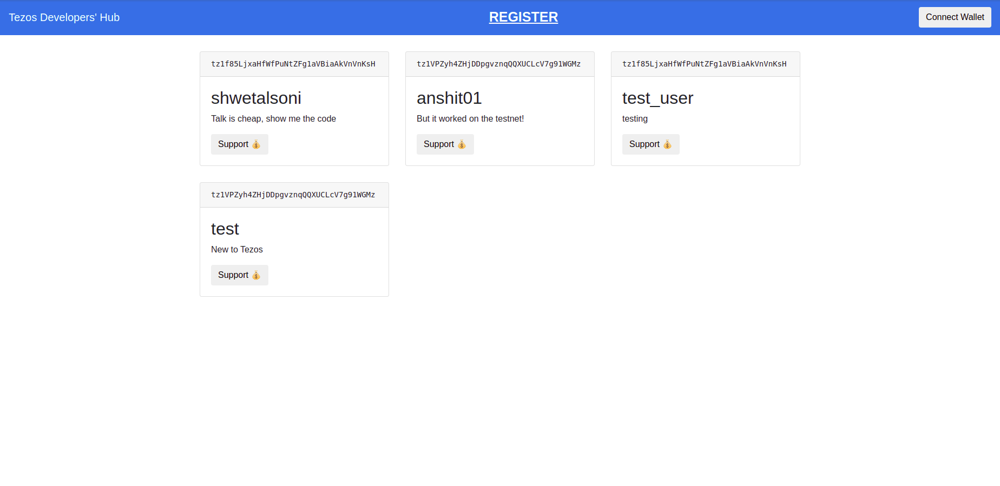

# Overview

In this tutorial, you will build a starter project on Tezos in which you'll learn the following:

- Writing a Smart Contract
- Deploying and Interacting with a Smart Contract
- Integrating with Frontend

You will create a DApp called **Tezos Developer Hub** for all Tezos developers. This will be a very basic project, covering all the building blocks of a DApp. 

> **Note:**
The main objectives of this tutorial are to:
1. Provide a basic understanding of smart contracts
2. Make transactions using the wallet on blockchain
3. Interact with smart contracts using frontend.
> 

The features of this DApp will be 

- Display the names of all the registered Tezos developers
- A feature to register a developer into the hub
- Send some *tez* to any of the registered tezos developers.

Once finished, the DApp will look like this:

After completing this tutorial, You will be confident enough to start building your own DApp.
