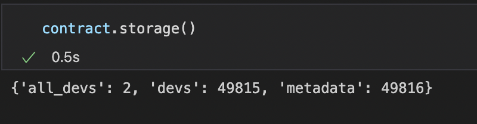

# PyTezos

PyTezos is a Python library for interacting with Tezos blockchain and testing smart contracts.

With PyTezos, you can do the following:

- Accessing blockchain data
- Injecting transactions into the blockchain
- Originate contracts
- Packing and signing Michelson data
- Testing contracts

And many more.

<aside>
💡 This tutorial uses hangzhounet.
As tezos is upgradable, new testnets appear after every 3 months and older ones are made absolute. So, always use the latest testnet.

</aside>

# Install

Install the PyTezos library using pip.

```bash
pip install pytezos
```

PyTezos requires some platform-specific dependencies. In case of issues with installation, refer [here](https://pypi.org/project/pytezos/) for installation instructions for your OS.

# Using PyTezos

PyTezos works best with [Jupyter notebooks](https://code.visualstudio.com/docs/datascience/jupyter-notebooks). You can see the parameter structure of entrypoints, contract storage, etc easily using Jupyter notebook.

```python
from pytezos import pytezos

pytezos = pytezos.using(shell = "https://hangzhounet.smartpy.io/", key = "edsk..")
```

The RPC URL is set using the `shell` parameter. Enter your private key in the `key` field. It will be used to sign operations.

## Reading balance

Get the balance of your wallet address using `pytezos.balance()`

## Transfer tez

Send xtz to an address as follows

```python
pytezos.transaction("<tz.. or KT.. address>", amount=10000000).send()
```


## Interacting with smart contract

Get the contract instance as follows

```python
contract = pytezos.contract("KT1VpKSj44yAVShjPt5AAXksaMYn3xKsB46c")
```

Then you can execute `contract` to see its content in Jupyter notebook.


### Accessing contract storage

Run the following to see the contract storage parsed into a simple Python dictionary.

```python
contract.storage()
```



### Accessing Bigmap value

Bigmap values can be accessed using the name of bigmap and one of its key in the following way.

```python
contract.storage['devs'][0]()
# here 'devs' is the name of bigmap and 0 is a key.
```


## Calling entrypoint

You can see the entrypoint parameter structure (`register` entrypoint in this case) as follows:

```python
contract.register
```


Using the `Typedef` shown above, you can build the parameters in the same format and call the entrypoint.

```python
contract.register({
    'bio': "I am a developer",
    'name': "John Doe"
}).send()
```


<aside>
👨‍💻 Try accessing the bigmap storage to see the data with which you just registered.

</aside>

## References

[https://pytezos.org/](https://pytezos.org/)

[https://pytezos.org/contents.html](https://pytezos.org/contents.html)

In case of doubts, ask here: [https://t.me/baking_bad_chat](https://t.me/baking_bad_chat)

