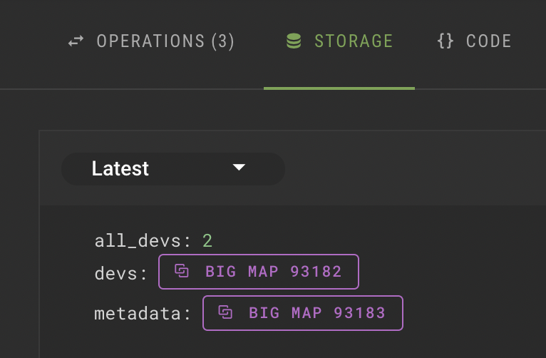

# TzKT Indexer API

[TzKT.io](https://tzkt.io/) is a blockchain indexer and explorer for Tezos. You can use it to see most blockchain data easily, including but not limited to anyone's transactions, token balances, baking rewards, etc.

TzKT Explorer provides free REST API and WebSocket API for accessing detailed Tezos blockchain data and helps developers build more services and applications on top of Tezos.

# Accessing data from RPC vs Indexer

### Using RPC

RPC means the tezos node API, that is usually used with Taquito, as illustrated [here](https://www.notion.so/Integrating-with-frontend-544c2a256d164a4a9f2e927c165b2f45). 

- It provides real-time blockchain updates when the node is in sync with the Tezos network.
- But its API is not very flexible and can't be used to access huge data at once, like fetching a complete bigmap at once.

### Using Indexer

Blockchain indexer is a tool that monitors the blockchain for new blocks.

- It keeps a record of all the transactions and contract storage in a well-indexed database.
- It allows performing complex queries on the blockchain data.
- Using an indexer is crucial for building scalable dApps.

<aside>
💡 RPC is generally used to fetch data only when it is critical to show real-time data (like token price data in a DEX), so there is no single point of failure (in case the indexer goes down). In all other cases, using an indexer is a better choice.

</aside>

# TzKT Indexer API

### Testnet and Mainnet APIs

Here are APIs for different Tezos networks:

- Mainnet - [api.tzkt.io](https://api.tzkt.io/)
- Granada testnet - [api.granadanet.tzkt.io](https://api.granadanet.tzkt.io/)
- Hangzhou testnet - [api.hangzhounet.tzkt.io](https://api.hangzhounet.tzkt.io/)

### Example APIs

- Get all accounts on mainnet
[`https://api.tzkt.io/v1/accounts`](https://api.tzkt.io/v1/accounts)
- Top 10 *tez* holder accounts
[`https://api.tzkt.io/v1/accounts?sort.desc=balance&select=address,balance&limit=10`](https://api.tzkt.io/v1/accounts?sort.desc=balance&select=address,balance&limit=10)
- Get all operations on a contract
[`https://api.florencenet.tzkt.io/v1/operations/transactions?target=KT1Qf7edc37iMtPZPqvVxPSgpRsdhmjJkh71&limit=1000`](https://api.florencenet.tzkt.io/v1/operations/transactions?target=KT1Qf7edc37iMtPZPqvVxPSgpRsdhmjJkh71&limit=1000)

### Accessing Bigmap data

You can access all the data of a bigmap in one query.

- Get the bigmap id from better call dev.
    
    
    
- Get data for the `devs` bigmap using the following query
[`https://api.florencenet.tzkt.io/v1/bigmaps/93182/keys?limit=10000`](https://api.florencenet.tzkt.io/v1/bigmaps/93182/keys?limit=10000)

> Explore the API docs here [api.tzkt.io](https://api.tzkt.io/)
> 

# Dipdup

Dipdup is a tool that applies selective indexing techniques to ensure a fast initial sync phase and the most efficient use of public API endpoints. It is useful for building custom backends for decentralized applications.

Learn more about it at [dipdup.net](https://dipdup.net/)

