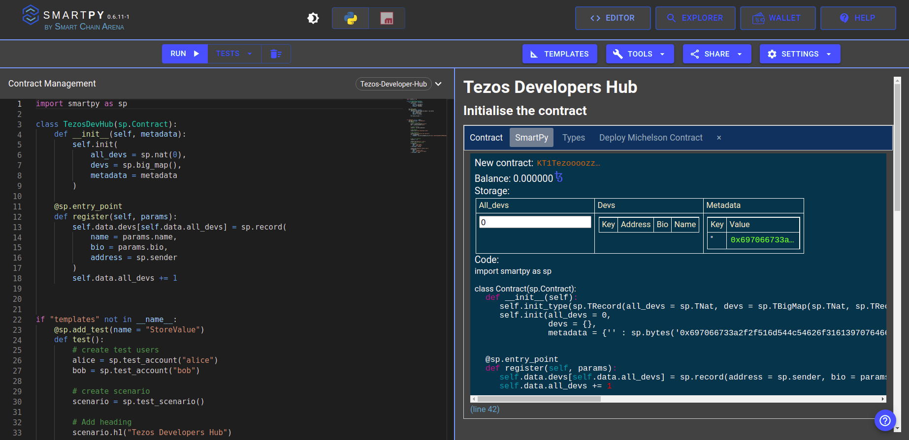

# Writing Smart Contracts

[SmartPy](https://smartpy.io/) is an intuitive and powerful smart contract development platform for Tezos. The SmartPy language is based on Python. So, having prior experience with Python would come in handy. 

The SmartPy code is compiled down to **Michelson** - a domain-specific low-level programming language for smart contract development on Tezos.

In this section, you will learn to write a smart contract for **Tezos Developer Hub** using SmartPy. The contract will store the details of all registered developers (name, bio, and [wallet address](https://www.notion.so/Glossary-e9a82a9d0faa4d279ecee6faa6b3e7c5)), and there will be an *entry point* to register new developers.

For writing the smart contract, go to [SmartPy IDE](https://smartpy.io/ide) and follow the steps below: 

### 1. Initializing contract storage

Let's get started with importing the SmartPy library.

```jsx
import smartpy as sp
```

In SmartPy, a contract is defined by a class that inherits from `sp.Contract`.

```python
class TezosDevHub(sp.Contract):
    def __init__(self):
        pass
```

The first step in creating a contract is defining its **storage**. The storage contains all the data that defines the state of the contract. You have to define it using `self.init()` function inside the constructor.

In this contract, you have to create a `devs` map for storing the data of all the devs. The map will hold key-value pairs. The key will be a unique natural number and the value will be a record (similar to a struct in C/C++) of name, bio, and wallet address.

> A map can be accessed similar to a Python dictionary.
> 

Another variable that you have to define here is `all_devs` which will store the total number of registered devs.

Optionally, you can also store the `metadata` of the contract that gives the overview of the contract. So, people can browse the contract by its name on [better-call.dev](https://better-call.dev/).

```python
import smartpy as sp

class TezosDevHub(sp.Contract):
    def __init__(self, metadata):
        self.init(
            all_devs = sp.nat(0),
            devs = sp.map(),
            metadata = metadata
        )
```

### 2. Creating an entry point

After the contract has been initialized, the next step is to create an entry point.

An entry point is a function that can be called from outside the contract and can change the state of storage of the contract.

<aside>
💡 Changing the storage does not go against the basic principle of immutability of data on the blockchain. All the previous versions of storage can be retrieved from the transactions and are easily available on blockchain indexers.

</aside>

In SmartPy, an entry point is defined as a function decorated with `sp.entry_point`.

In this contract, you have to create a `register` entry point that will be used to register devs. The data is passed in `param` object.

The contract storage is accessed using `self.data`.

In this entry point, you have to store a record of name, bio and address in the `devs` map and then  increment `all_devs` variable by 1.

```python
    @sp.entry_point
    def register(self, params):
        self.data.devs[self.data.all_devs] = sp.record(
            name = params.name,
            bio = params.bio,
            address = sp.sender
        )
        self.data.all_devs += 1
```

### 3. Writing tests

Now you are done with writing a smart contract, follow the steps below to write some tests. Tests are very crucial in smart contract development, as smart contracts cannot be modified after being deployed. Also, many smart contracts are responsible for handling transactions worth millions. So it's very important to write tests covering all cases.

- **Define a function with `sp.add_test` decorator.**

```python
    @sp.add_test(name = "StoreValue")
    def test():
        pass
```

- **Create some test accounts**

```python
        alice = sp.test_account("alice")
        bob = sp.test_account("bob")
```

- **Create the test scenario**
    
    Scenario provides an environment for testing contracts.
    

```python
        # create scenario
        scenario = sp.test_scenario()
        # Add heading
        scenario.h1("Tezos Developers Hub")
```

- **Initialize the contract**
    
    The metadata is created using `metadata_of_url` utility function. Here, it is stored on [IPFS](https://www.notion.so/659a49100bfa476da119e29dfcd92ed2). You can view it [here](https://cloudflare-ipfs.com/ipfs/QmTLTbo1a9pvFf2nPNKoLUNjokyw4An9PSVkx82QzKDCtj).
    

```python
        scenario.h2("Initialise the contract")
        c1 = TezosDevHub(
            metadata = sp.utils.metadata_of_url("ipfs://QmTLTbo1a9pvFf2nPNKoLUNjokyw4An9PSVkx82QzKDCtj")
        )
        # Add c1 to scenario
        scenario += c1
```

- **Call the entry point**
    
    The `sender` parameter of `.run()` function simulates the wallet address of the sender.
    

```python
        scenario.h2("Register a user")
        c1.register(
            name = "Alice the geek",
            bio = "Heyy there!"
        ).run(sender = alice)

        scenario.h2("Register another user")
        c1.register(
            name = "Bob",
            bio = "Hii I'm new to Tezos"
        ).run(sender = bob)
```

### 4. Run the smart contract

Woohoo! The smart contract is ready to go. Run it and see the result on the right.



## References

- You can find the complete smart contract for this project [here](https://gist.github.com/shwetalsoni/93686d818d5786c49ff3fcb64a421392).
- Find the official documentation of SmartPy [here](https://smartpy.io/docs/).
- In case of doubts, ask here: [https://t.me/SmartPy_io](https://t.me/SmartPy_io)

<aside>
💡 SmartPy also offers a new Typescript syntax. Check it out [here](https://smartpy.io/ts-ide).

</aside>
